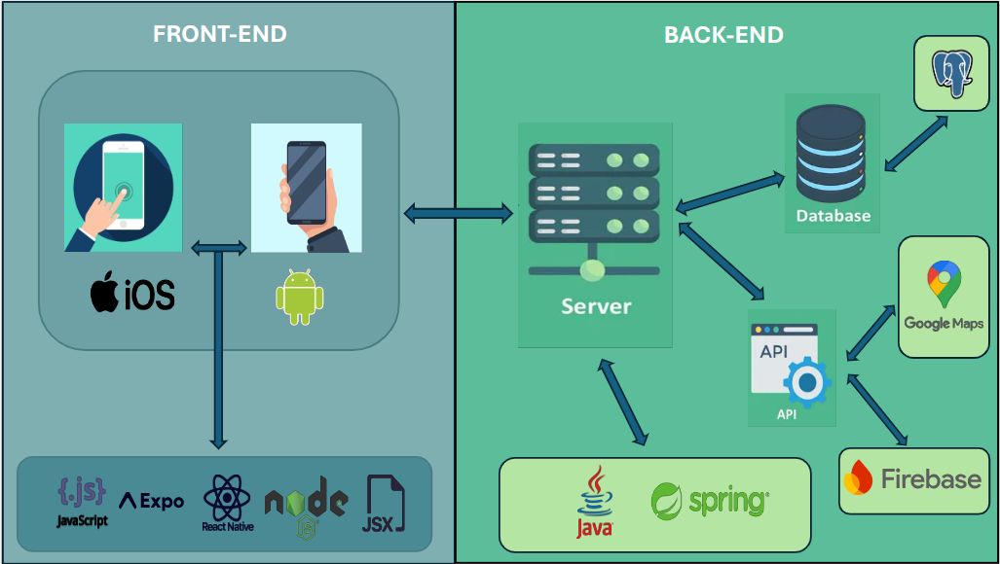
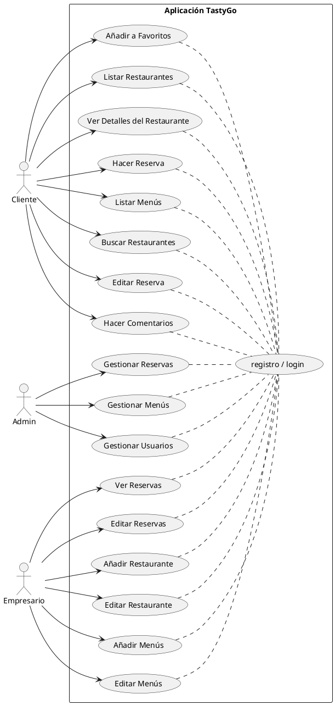
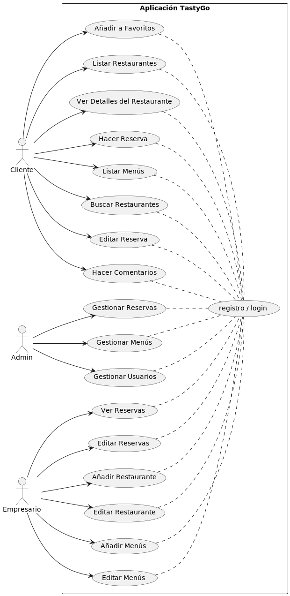
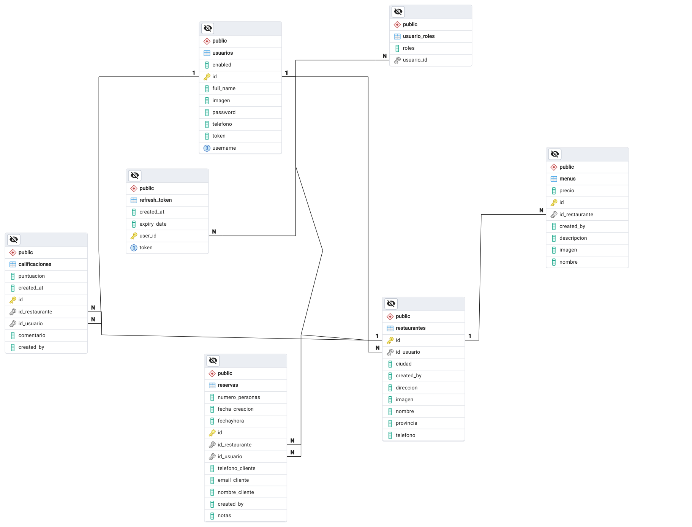
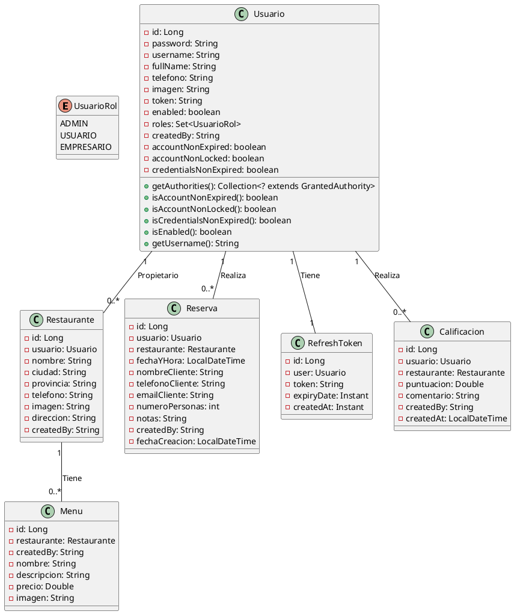
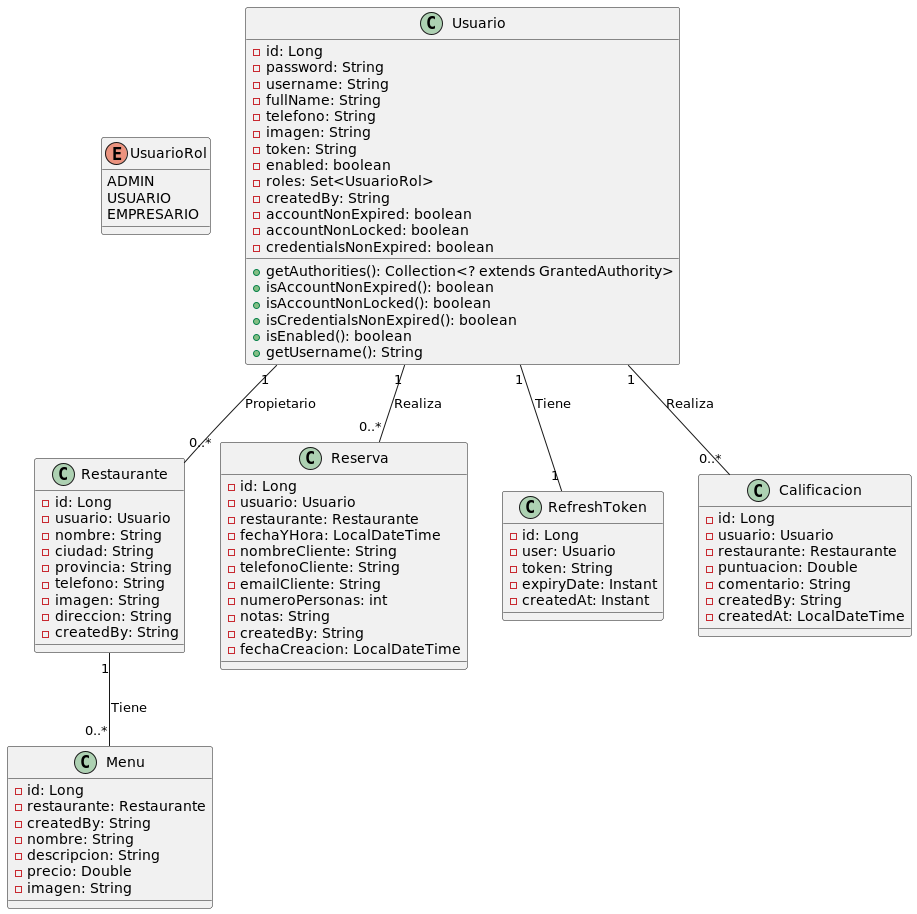

\newpage

## Análisis

### Diagrama de Arquitectura de Aplicación

#### Componentes Principales:

1. **Cliente (Frontend)**:
    - Aplicación móvil desarrollada con React Native y Expo.
    - Utiliza componentes reutilizables y gestiona el estado localmente.
    - Se comunica con el Backend a través de API REST.

2. **Servidor (Backend)**:
    - Desarrollado con Spring Boot.
    - Expone una API RESTful para manejar operaciones CRUD.
    - Implementa seguridad con Spring Security para autenticación y autorización.
    - Se conecta a una base de datos PostgreSQL para almacenar y recuperar datos.
    - Interactúa con Firebase para almacenar y gestionar imágenes.

3. **Base de Datos**:
    - PostgreSQL utilizada para almacenar información clave como usuarios, restaurantes, reservas, menús y calificaciones/opiniones.
    - Almacena el nombre de imágenes alojadas en Firebase Storage.

4. **Firebase**:
    - **Firebase Storage**: Utilizado para almacenar imágenes relacionadas con los restaurantes.
    - **Firebase Admin SDK**: Integrado con el Backend para la gestión de archivos en Firebase Storage y autenticación adicional.

#### Interacciones:

- **Cliente (Frontend)**:
    - Realiza peticiones HTTP a las rutas definidas en el Backend para obtener y enviar datos.
    - Recibe URLs de imágenes almacenadas en Firebase a través de respuestas del Backend.

- **Servidor (Backend)**:
    - Recibe peticiones HTTP del Cliente y las enruta a los controladores correspondientes.
    - Gestiona la lógica de negocio y la integración con la base de datos PostgreSQL.
    - Utiliza Firebase Admin SDK para almacenar y gestionar imágenes en Firebase Storage.

- **Base de Datos**:
    - Almacena datos estructurados relacionados con usuarios, restaurantes, reservas, menús y calificaciones/opiniones.
    - Almacena nombre de las imágenes en PostgreSQL relacionadas con los registros de restaurantes.

    
### Diagrama de Casos de Uso

El Diagrama de Casos de Uso es una herramienta fundamental en el desarrollo de software que permite representar las 
interacciones entre los usuarios (actores) y el sistema. En el contexto del "Sistema de Gestión de Restaurantes" 
(TastyGo), se han identificado varios actores principales: Cliente, Admin y Empresario.

Este diagrama visualiza cómo cada actor interactúa con la aplicación para realizar diversas acciones:

\newpage

Este diagrama muestra cómo cada tipo de usuario interactúa con la aplicación, desde realizar reservas y gestionar menús 
hasta administrar usuarios y reservas. Proporciona una vista clara de las funcionalidades que el sistema ofrece y cómo 
se distribuyen entre los diferentes roles de usuarios.

El uso de UML, en particular los Diagramas de Casos de Uso, facilita la comprensión y comunicación de los requerimientos
y funcionalidades del sistema tanto para desarrolladores como para usuarios finales.

### Diagrama Entidad-Relación

El diagrama entidad-relación describe la estructura de la base de datos y las relaciones entre las entidades principales,
tales como `usuarios`, `restaurantes`, `reservas`, `menu` y `calificaciones_opiniones`.

\newpage
### Diagrama de Clases

#### Clases del Sistema de Gestión de Restaurantes

#### Clase Usuario:

Representa un usuario del sistema con todos los atributos necesarios para la autenticación y gestión de información personal.

\newpage

#### Atributos:
- `id`: Identificador único del usuario.
- `password`: Contraseña del usuario.
- `username`: Nombre de usuario único.
- `fullName`: Nombre completo del usuario.
- `telefono`: Número de teléfono del usuario.
- `imagen`: URL de la imagen del usuario.
- `token`: Token de autenticación del usuario.
- `enabled`: Indica si la cuenta del usuario está habilitada.
- `roles`: Conjunto de roles (`UsuarioRol`) asignados al usuario.
- `createdBy`: Usuario que creó el registro del usuario.

#### Métodos:
- `getAuthorities()`: Devuelve las autoridades del usuario para la autenticación.
- Métodos de verificación de la vigencia de la cuenta (`isAccountNonExpired()`, `isAccountNonLocked()`, `isCredentialsNonExpired()`, `isEnabled()`).

#### Clase Restaurante:

Representa un restaurante registrado en el sistema.

#### Atributos:
- `id`: Identificador único del restaurante.
- `usuario`: Usuario propietario del restaurante.
- `nombre`: Nombre del restaurante.
- `ciudad`: Ciudad donde se encuentra el restaurante.
- `provincia`: Provincia donde se encuentra el restaurante.
- `telefono`: Número de teléfono del restaurante.
- `imagen`: URL de la imagen del restaurante.
- `direccion`: Dirección física del restaurante.
- `createdBy`: Usuario que creó el registro del restaurante.

#### Clase Reserva:

Representa una reserva realizada por un usuario en un restaurante específico.

\newpage

#### Atributos:
- `id`: Identificador único de la reserva.
- `usuario`: Usuario que realiza la reserva.
- `restaurante`: Restaurante donde se realiza la reserva.
- `fechaYHora`: Fecha y hora de la reserva.
- `nombreCliente`: Nombre del cliente que realiza la reserva.
- `telefonoCliente`: Teléfono de contacto del cliente.
- `emailCliente`: Correo electrónico del cliente.
- `numeroPersonas`: Número de personas incluidas en la reserva.
- `notas`: Notas adicionales sobre la reserva.
- `createdBy`: Usuario que creó la reserva.
- `fechaCreacion`: Fecha y hora de creación de la reserva.

#### Clase RefreshToken:

Representa un token de actualización asociado a un usuario para autenticación.

#### Atributos:
- `id`: Identificador único del token.
- `user`: Usuario al que pertenece el token.
- `token`: Valor único del token.
- `expiryDate`: Fecha de expiración del token.
- `createdAt`: Fecha de creación del token.

#### Clase Menu:

Representa un menú asociado a un restaurante.

#### Atributos:
- `id`: Identificador único del menú.
- `restaurante`: Restaurante al que pertenece el menú.
- `createdBy`: Usuario que creó el menú.
- `nombre`: Nombre del menú.
- `descripcion`: Descripción del menú.
- `precio`: Precio del menú.
- `imagen`: URL de la imagen del menú.

\newpage

#### Clase Calificacion:

Representa la calificación y comentario de un usuario sobre un restaurante.

#### Atributos:
- `id`: Identificador único de la calificación.
- `usuario`: Usuario que realiza la calificación.
- `restaurante`: Restaurante calificado.
- `puntuacion`: Puntuación otorgada al restaurante.
- `comentario`: Comentario realizado por el usuario.
- `createdBy`: Usuario que creó la calificación.
- `createdAt`: Fecha y hora de creación de la calificación.

#### Relaciones

#### Relación Usuario - Reserva
- Un usuario puede realizar varias reservas (1 a 0..*).

#### Relación Usuario - RefreshToken
- Un usuario puede tener asociado un token de actualización (1 a 1).

#### Relación Usuario - Calificación
- Un usuario puede realizar varias calificaciones de restaurantes (1 a 0..*).

#### Relación Usuario - Restaurante
- Un usuario puede ser propietario de uno o varios restaurantes (1 a 0..1).

#### Relación Restaurante - Menu
- Un restaurante puede tener varios menús (1 a 0..*).
